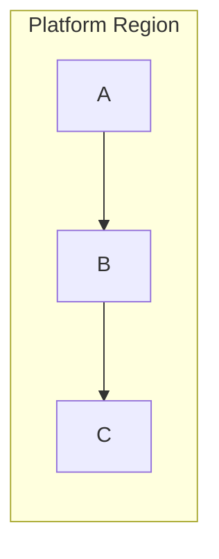
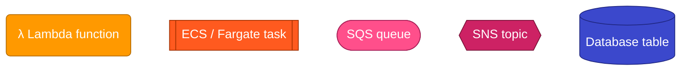

# Draw Infra Diagram

How to draw infrastructure diagrams in Mermaid that someone can actually use to debug a problem.

This is the AWS / cloud specialist. For sequence diagrams, state machines, class diagrams, ER diagrams, gantt charts, or generic flowcharts, use **`draw-mermaid-diagram`** — it owns the general syntax cheatsheets and the validation tool that the rest of this skill assumes.

## Core principles

Three rules carry most of the value:

1. **Shape encodes service type.** Cylinders for databases, pills for queues, hexagons for fanout topics, rhombuses for routers, subroutine bars for long-running containers, rounded rectangles for serverless functions, dashed rectangles for external sources. The reader's eye learns the vocabulary in one glance at the legend.

2. **Color encodes the specific service, not the category.** Lambda is orange, ECS is a different orange, Batch is a third orange — the reader recognizes "Lambda" by color even with the label hidden. Don't paint all "compute" services one color; you lose distinction.

3. **Subgraph tint encodes region or scope.** Service identity travels with the node (color + shape); location travels with the background. The reader can see at a glance "this is in the platform region" vs "this is in a target region" without parsing subgraph labels.

## Workflow

### 1. Verify resource names *before* drawing

Open the infra source (Terraform `*.tf`, CloudFormation, CDK, Helm) and grep the actual names of every resource you plan to put in a diagram. Do not trust prior agent exploration or memory.

Common bugs caught by this step:

- Lambda was renamed but old name appears in docs / prior outputs
- ECS task log group is `/fargate/tasks/...` not `/ecs/tasks/...` (or vice versa)
- Lambda Terraform module name differs from the deployed function name (extra prefix segment)
- A queue or function name has a typo in production that's preserved across deployments
- A resource referenced in code or docs was removed but the reference wasn't

If a resource name has interpolation (`${var.prefix}-x`), keep the placeholder syntax (`{prefix}-x`) in the diagram — each customer's deployment uses its own prefix.

### 2. Choose direction and subgraphs

`flowchart TD` for top-down (default for most flows). `flowchart LR` for left-right.

A single subgraph containing a linear chain of nodes will sometimes render horizontally even with `TD`. Force vertical:



Long subgraph labels truncate in renderers. Keep them short ("Execution Cluster (EC2)" works; "Execution Cluster (EC2, scale-to-zero)" truncates). Push detail into the prose around the diagram.

### 3. Apply the shape vocabulary

| Service type | Shape | Mermaid syntax |
|---|---|---|
| Serverless function | rounded rectangle | `id("label")` |
| Container task / service | subroutine | `id[["label"]]` |
| Job / batch task | subroutine | `id[["label"]]` |
| Queue | stadium / pill | `id(["label"])` |
| Topic / fanout | hexagon | `id{{"label"}}` |
| Router / rule | rhombus | `id{"label"}` |
| Database / table | cylinder | `id[("label")]` |
| External source / trigger | rectangle (dashed via classDef) | `id["label"]` |

Full Mermaid shape reference: https://mermaid.js.org/syntax/flowchart.html

### 4. Apply the color palette (AWS default)

```
classDef lambda fill:#FF9900,stroke:#B36B00,color:#fff
classDef ecs fill:#FF5A1F,stroke:#A33000,color:#fff
classDef batch fill:#EC7211,stroke:#9C4500,color:#fff
classDef sqs fill:#FF4F8B,stroke:#A82158,color:#fff
classDef sns fill:#CD2264,stroke:#7A1238,color:#fff
classDef eventbridge fill:#E91E63,stroke:#88102F,color:#fff
classDef dynamo fill:#3B48CC,stroke:#1F2680,color:#fff
classDef postgres fill:#336791,stroke:#1B3A55,color:#fff
classDef dlq fill:#3A3A3A,stroke:#999,color:#fff,stroke-dasharray:4 3
classDef external fill:#444,stroke:#222,color:#fff,stroke-dasharray:3 3
```

**Extending to other clouds.** Keep "one color per service, not per category." For GCP, give Pub/Sub, Cloud Run, Firestore, BigQuery their own distinct hues. For Azure, Service Bus, Functions, Cosmos DB likewise. Pick distinct, saturated colors that read clearly with white text. A 6–8 color palette is plenty for most diagrams.

When sharing a doc across clouds, fall back to a more abstract mapping — service-category color (compute / messaging / storage) — but acknowledge the loss of per-service distinction.

### 5. Tint subgraphs for region or scope

```
style PlatformRegion fill:#1E3A5F22,stroke:#1E5BA8
style TargetRegion fill:#5F1E1E22,stroke:#C73E1D
style CustomerAccount fill:#3A3A3A22,stroke:#666
style ExecutionCluster fill:#3A2E1E22,stroke:#A87A1E
```

The `22` suffix is alpha (~13% opacity) — keeps the tint subtle so it doesn't compete with node colors.

### 6. Render the legend as a Mermaid example, not a hex table

A hex-code legend table is useless to readers — they can't pattern-match colors from `#FF4F8B` to "the pink one in the diagram." Render the legend as a small flowchart showing each shape+color side by side, with `~~~` invisible edges to control ordering:



Place this once near the top of the doc. All subsequent diagrams reuse the same vocabulary without their own legend.

### 7. Annotate compute nodes inline

Compute nodes (lambdas, container tasks) get a second line in italic with the operational identifier the reader will paste into a console — log group path, ARN, queue URL. Use HTML inside quoted labels:

```
L_PBE("λ process-binding-event<br/><i>/aws/lambda/{prefix}-process-binding-event</i>"):::lambda
```

The label must be quoted (`("...")`) because it contains HTML. Don't move log-group names to tooltips, a sidebar table, or footnotes — they're load-bearing payload, the whole point of the diagram for a debugging audience.

### 8. Style failure paths to fade

Failure / DLQ paths should visually de-emphasize:

- DLQ nodes: dashed border via classDef (`stroke-dasharray:4 3`)
- Edges to DLQ: dotted via `-.->` (instead of solid `-->`)
- Edge label: `on failure` (consistent across diagrams)

The reader's eye follows solid `-->` arrows for happy path; dotted lines are an exit ramp.

### 9. Edge labels

Short, present tense, action verbs matching the data flow direction. Consistent across diagrams in the same doc.

Common: `Triggers`, `Enqueue`, `Publishes`, `Subscribes`, `Fan-out per region`, `Cross-region`, `Writes`, `Reads`, `Polls`, `on failure`.

Avoid full sentences. Avoid describing what the next stage does ("processes the message and stores it in the database") — that's the next node's job to convey.

### 10. Validate and export

Quick syntax check during authoring — use the validator from the sibling `draw-mermaid-diagram` skill:

```bash
${CLAUDE_SKILL_ROOT}/../draw-mermaid-diagram/tools/validate.sh diagram.mmd
```

Non-zero exit means invalid Mermaid. First run downloads a headless Chromium via Puppeteer (one-time, ~100MB).

For a higher-resolution render with the Mermaid CLI directly:

```bash
mmdc -i diagram.mmd -o diagram.png -w 1800
```

Or extract every Mermaid block from a markdown doc and render each:

```bash
awk '/^```mermaid$/{f=1;n++;o="d-"n".mmd";next} /^```$/{f=0;next} f{print > o}' guide.md
for f in d-*.mmd; do mmdc -i "$f" -o "${f%.mmd}.png" -w 1800; done
```

PDF export of a markdown doc with embedded Mermaid requires a **two-step pipeline** — `md-to-pdf` claims Mermaid support but does not actually render the blocks; `mmdc` pre-substitutes them as PNG references first:

```bash
mmdc -i guide.md -o /tmp/rendered.md -e png -w 1600
npx -y md-to-pdf /tmp/rendered.md
```

Confirm the output PDF actually shows rendered diagrams, not Mermaid source.

## Document structure for debugging-oriented diagrams

When the diagram is for a customer or support engineer debugging a problem (not a system designer), wrap it in this structure:

1. **Intro** — what this doc is for, who it's for
2. **How to use this doc** — 1, 2, 3 steps from symptom to log group (or analogous resource)
3. **Gotchas section** — region selectors, naming surprises, log-group convention quirks
4. **Visual legend** — rendered Mermaid (§6)
5. **Symptom-to-diagram index** — lookup table: "I see X → start at Diagram Y → check log group Z"
6. **Diagrams** — with inline log-group annotations (§7)
7. **Per-flow callouts** — for workflows that share a diagram, callout boxes under the diagram explain per-workflow specifics
8. **Drop-in queries** — CloudWatch Insights, log-aggregator queries, kubectl commands — scoped per diagram so the reader can copy-paste
9. **What we don't cover yet** — explicit pointers to adjacent docs/runbooks so the reader knows where the map ends
10. **Where to verify** — footer linking the authoritative source files (Terraform, code, schema) so the next maintainer can fact-check before editing

The symptom-to-diagram index (§5) is the most commonly skipped section and the highest-leverage one. Without it, multiple diagrams collapse into "we condensed your questions" — readers can't find the right starting point.

## Anti-patterns

- **All-rectangle diagrams.** Every node is a rectangle; color-only differentiation. Reader has to read every label. Shape is a free channel — use it.
- **Color-by-category.** All compute one color, all data another. Loses service-level distinction; a Lambda failure looks the same as an ECS failure at a glance.
- **Hex-code legend tables.** See §6.
- **Per-workflow diagrams when N of M workflows share a flow.** Better: one shared diagram + per-workflow callout boxes. Six near-identical pictures aren't six diagrams — they're noise.
- **Embedding the same tail in every flow diagram.** If three diagrams all end with the same 4 nodes, either factor the tail into its own diagram and link, or inline the tail in each (preferable when the cross-reference cost beats the duplication cost). Don't sit on the fence.
- **DLQs hidden.** "Stuck in DLQ" is a top-tier debugging signal. De-emphasize visually (§8) but never omit.
- **Stale resource names.** See §1. Same shape of bug bites repeatedly when authors trust prior outputs over current source.
- **Customer-data leakage.** When the diagram comes from real-world tracing, scrub account IDs, customer names, and ticket IDs before publishing. Use placeholders.

## Reference

- Mermaid flowchart syntax: https://mermaid.js.org/syntax/flowchart.html
- Mermaid CLI (`mmdc`): https://github.com/mermaid-js/mermaid-cli
- AWS Architecture Icons (color reference): https://aws.amazon.com/architecture/icons/
- `md-to-pdf` (export pipeline): https://github.com/simonhaenisch/md-to-pdf

## Related skills

- **`draw-mermaid-diagram`** — general Mermaid skill. Houses syntax cheatsheets for the non-infra diagram types and the `validate.sh` tool used above.
