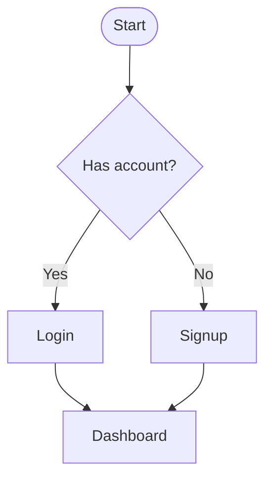
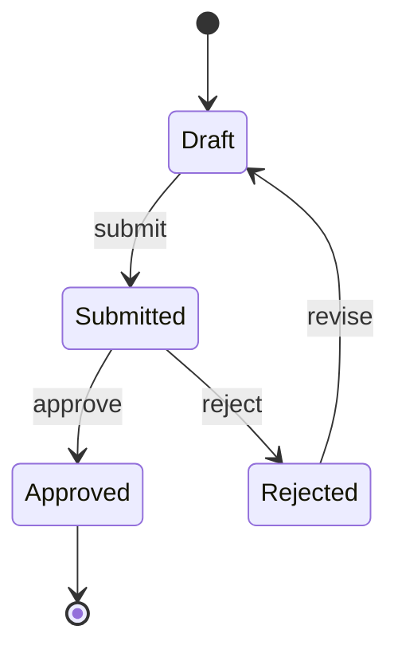
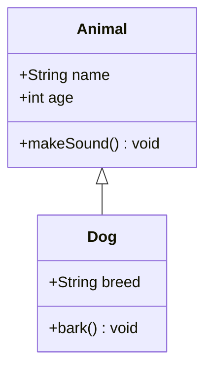
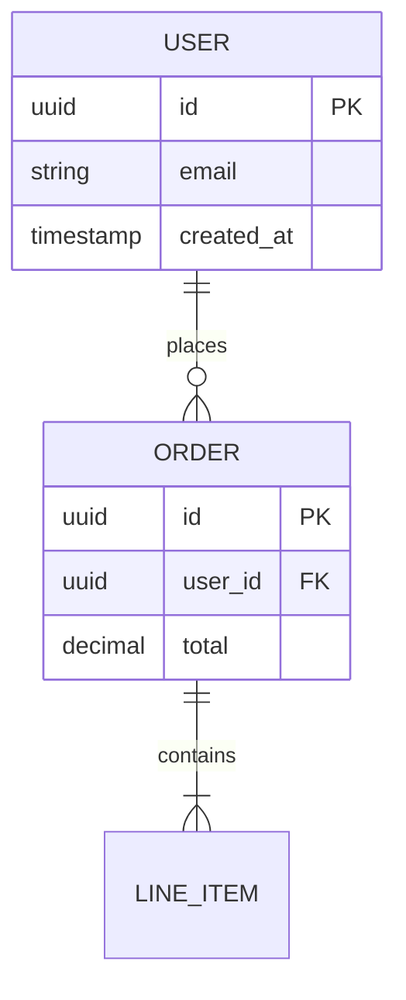
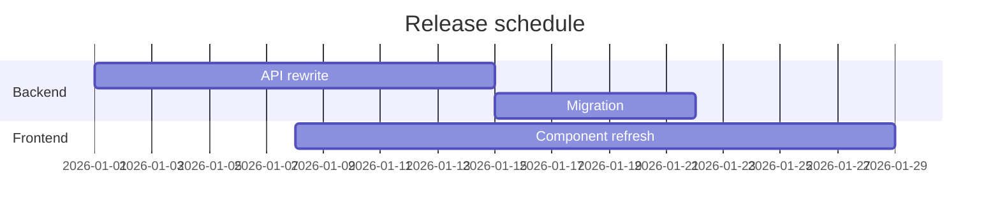

# Draw Mermaid Diagram

General-purpose guidance for drawing and validating Mermaid diagrams. For AWS / cloud architecture diagrams, switch to `draw-infra-diagram`.

## When to use which diagram type

| Diagram type | Use for | Mermaid header |
|---|---|---|
| Flowchart | General process / decision flow | `flowchart TD` (or `LR`) |
| Sequence | Ordered messages between actors over time | `sequenceDiagram` |
| State | Lifecycle / state machine | `stateDiagram-v2` |
| Class | OO class structure, relationships | `classDiagram` |
| ER | Database entities and relationships | `erDiagram` |
| Gantt | Project schedule | `gantt` |
| Timeline | Chronological events | `timeline` |
| Mindmap | Hierarchical brainstorm | `mindmap` |
| Journey | User journey with sentiment scores | `journey` |
| Pie | Proportion of categorical data | `pie` |

If you're not sure: a flowchart with action nodes is rarely wrong. Sequence is for ordered communication; state is for "what state can the thing be in." ER is for data models, not behavior.

## Authoring workflow

1. **Draft in a standalone `.mmd` file.** Easier to validate than a fenced block inside Markdown.
2. Write the diagram.
3. Validate: `./tools/validate.sh diagram.mmd`
4. Once it validates, copy the contents into the target Markdown file as a fenced ```mermaid block.

The validator catches syntax errors before they surface as a broken render in the published doc. See [Validation](#validation) below.

## Syntax cheatsheets

### Flowchart



Direction: `TD` (top-down), `BT`, `LR`, `RL`. Edge styles: `-->` solid, `-.->` dotted, `==>` thick. Node shapes are documented under "shape vocabulary" in the Mermaid docs.

### Sequence

```mermaid
sequenceDiagram
    participant User
    participant Browser
    participant API
    participant DB
    User->>Browser: Click "Sign in"
    Browser->>API: POST /auth/login
    API->>DB: SELECT user WHERE email=?
    DB-->>API: user row
    API-->>Browser: 200 + session cookie
    Browser-->>User: Dashboard
```



`->>` solid arrow, `-->>` dashed (response), `->` open arrow, `--)` async. `Note over A,B: text` for annotations. `loop`, `alt/else`, `opt`, `par` for control flow.

### State



`[*]` is the start/end pseudo-state. Use `state X { ... }` for nested composite states.

### Class



Relationships: `<|--` inheritance, `*--` composition, `o--` aggregation, `-->` association, `..>` dependency.

### ER



Cardinality: `||` exactly one, `}o` zero or many, `}|` one or many, `o|` zero or one. Mirrored on the other side of the relation.

### Gantt



## Validation

```bash
./tools/validate.sh diagram.mmd
```

The script invokes `npx -y @mermaid-js/mermaid-cli` to parse and render the diagram. Non-zero exit means invalid syntax. When supported by the diagram type, it also prints an ASCII preview via `beautiful-mermaid`.

**First-run gotcha:** the Mermaid CLI uses Puppeteer, which downloads a headless Chromium on first invocation. This is slow (~100MB, one-time). On systems where that download fails (CI sandboxes, restricted networks), set `PUPPETEER_EXECUTABLE_PATH` to point at an existing Chrome/Chromium binary.

Optional second arg writes the rendered SVG to disk:

```bash
./tools/validate.sh diagram.mmd /tmp/diagram.svg
```

Without it, the SVG goes to a temp file and is cleaned up on exit.

## Layout gotchas

- **Linear chains in subgraphs** sometimes render horizontally even with `flowchart TD`. Force vertical with `direction TB` inside the subgraph.
- **Long labels** truncate in some renderers. Keep node and subgraph labels short — push detail into the prose around the diagram.
- **HTML in labels** requires the label be quoted: `id("text<br/>more text")`. Unquoted labels can't contain `<`, `>`, `(`, `)`, or `,`.
- **Reserved words.** `end`, `class`, `style`, `linkStyle` are keywords. If a node id collides, prefix it (`n_end` instead of `end`).

## Anti-patterns

- **Picking the wrong diagram type.** A flowchart of "states" is usually really a state diagram; force-fitting it loses the implicit time semantics. A sequence diagram of "components" is usually a class or component diagram.
- **All-rectangle flowcharts.** Mermaid's shape vocabulary is a free communication channel — use rounded boxes for processes, diamonds for decisions, stadiums for start/end, cylinders for data stores.
- **Skipping validation.** Markdown renderers fail Mermaid blocks silently in some setups; the doc looks fine in preview but breaks on the deployed site. Always validate.

## Reference

- Mermaid full syntax: https://mermaid.js.org/syntax/
- Mermaid CLI: https://github.com/mermaid-js/mermaid-cli
- Live editor (for ad-hoc tweaks): https://mermaid.live/

## Related skills

- **`draw-infra-diagram`** — AWS / cloud architecture specialist. Curated shape and color vocabulary, region-tinted subgraphs, debugging-oriented document structure. Builds on this skill.

## Adapted from

- [mitsuhiko/agent-stuff](https://github.com/mitsuhiko/agent-stuff/tree/main/skills/mermaid) — `tools/validate.sh`
