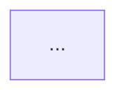

# Document Architecture — Reference

Detail backing [SKILL.md](SKILL.md). Loaded once at the start of the synthesis pass.

## Sub-agent layer briefs

Each Explore sub-agent gets one of the four briefs below. Output discipline is the same for all four: **raw findings only — bullet points, file:line references, no prose, no code snippets, no narrative.** The main agent owns the synthesis.

### Agent 1 — Data Layer

**Focus:** Models, schemas, persistent storage, entity relationships.

**Search for:**

- Django models, SQLAlchemy models, Pydantic models used for persistence, Prisma schemas, Go structs with DB tags, Mongoose schemas.
- Data structures used as transport types (DTOs, request/response models) at the edges of the system.
- Storage backends in use: relational DB, document DB, key-value cache, blob storage, message-queue persistence.
- Entity relationships and cardinality (one-to-many, many-to-many, polymorphic).

**Output:**

- List of key models / entities, one bullet each, with `file:line` for the definition.
- Storage backends in use, one bullet each.
- Notable relationships (top ~10).
- Diagram candidates: at most 2 (typically one ER, possibly one class diagram for OO-heavy modules).

### Agent 2 — API / Interface Layer

**Focus:** Public surface — what other systems and users call into.

**Search for:**

- HTTP routes (Flask `@app.route`, FastAPI `@app.get`, Django `urlpatterns`, Go `http.HandleFunc`, gin/echo routes, express routes).
- GraphQL schemas and resolvers.
- gRPC service definitions.
- CLI commands (argparse, click, cobra, commander).
- Public Python/JS/Go API surface exported from the module.
- Request/response shapes (referencing the data-layer models found by Agent 1, if obvious).

**Output:**

- List of routes / endpoints / commands, one bullet each, with `file:line`.
- Group by sub-area when there's an obvious split (e.g. `/admin/*` vs `/api/v1/*`).
- Diagram candidates: at most 2 (typically a sequence diagram for the primary read or primary write flow).

### Agent 3 — Business Logic

**Focus:** What happens between the API edge and the data layer — services, workflows, rules.

**Search for:**

- Service / use-case classes (Django services, FastAPI service modules, Go service packages).
- Workflow / pipeline / state-machine implementations.
- Validation and business-rule code.
- Background jobs and worker entry points (Celery tasks, Sidekiq jobs, Go worker mains, k8s Jobs).
- Critical decision points (e.g. "what determines whether an order ships immediately vs is queued").

**Output:**

- List of services / workflows, one bullet each, with `file:line` for the entry point.
- Top 3–5 critical decision points, one bullet each.
- Diagram candidates: at most 2 (typically one sequence diagram for the most important workflow, possibly a state diagram for a clear lifecycle like Order → Paid → Shipped → Delivered).

### Agent 4 — Integrations

**Focus:** External services, internal dependencies, asynchronous boundaries.

**Search for:**

- Third-party API clients (`stripe`, `twilio`, `slack_sdk`, AWS SDK, GCP SDK, internal SDKs).
- Event emission and consumption (SNS / SQS / Kafka / RabbitMQ / Redis pub-sub / Pub/Sub).
- Message queues and worker enqueue points.
- Internal service dependencies (other services in the same repo, other internal services called via HTTP/gRPC).
- Webhooks (incoming and outgoing).

**Output:**

- List of external integrations, one bullet each, with `file:line` for the client init / call site.
- List of internal dependencies, one bullet each.
- Event topics produced and consumed.
- Diagram candidates: at most 2 (often a flowchart of cross-system data flow; if AWS-shaped, propose an infra diagram).

## Template structure

The synthesized doc follows this structure. Skip a section if there's genuinely nothing to say — don't pad.

```markdown
# <Scope name> — Architecture

> Generated <YYYY-MM-DD> by `document-architecture`. Re-run when the system materially changes.

## Summary

One paragraph: what this is, who calls it, what it persists, what it depends on.
End with a one-sentence "open assessment" if there's a salient strength or risk
worth noting (e.g. "Workers depend on a single Redis instance — single point of
failure under current deployment topology").

## System Overview

Two to four sentences of context. Embed the **system overview flowchart** here.



## Core Architecture

### Directory layout

A short tree (5–10 lines max) of the top-level directories that matter, each
with a one-line description.

### Key components

Bulleted list of the ~5–10 most important components, each with a one-line
description and a `file:line` reference. This is the table of contents for
the layer sections below.

### Cross-cutting concerns

Anything that touches all layers (audit logging, request context propagation,
feature flags, multi-tenancy). One bullet each.

### Dependency direction

Only when the codebase actually exhibits layering (a domain/entities core
separate from adapters/infrastructure): name the rings and which way
dependencies point — e.g. "domain (`core/`) is pure; adapters in `infra/`
depend inward on it; nothing in `core/` imports a framework or the ORM." Note
any inward-pointing violation you observed (framework/ORM import inside the
domain) as an architectural risk. **Omit this subsection entirely for a flat
app that doesn't use layered boundaries** — don't impose Clean Architecture
vocabulary where the code doesn't.

## Data Layer

What it stores, where, and how things relate. Embed the **ER diagram** here if
one was drawn.

```mermaid
erDiagram
    ...
```

- Storage backends in use (PostgreSQL, Redis, S3) with `file:line` for the
  client init.
- Key entities (5–10), each with a one-line description and `file:line`.

## API / Interface Layer

What other systems and users call. Group by interface type (HTTP / gRPC / CLI).

- For HTTP / gRPC: list routes by sub-area, each with `file:line` for the
  handler.
- For CLI: list commands, each with `file:line`.

If there's a primary read flow worth illustrating, embed a **sequence diagram**
here.

## Business Logic

The services and workflows that connect API → data.

- List of services / use cases, each with `file:line`.
- Top 3–5 critical decision points, each as a one-paragraph description with
  the deciding code's `file:line`.

If there's a clear lifecycle worth illustrating, embed a **state diagram** here.

## Integration Layer

External clients, internal dependencies, async boundaries.

- External: list each integration with `file:line` for the client setup.
- Internal: list each internal service this depends on.
- Events: topics produced and consumed.

If AWS-shaped or cross-service-shaped, embed an **infra diagram** here.

## Data Flow Patterns

Pick 2–4 important flows and write them step-by-step. Each step is one line
with a `file:line` reference. Example:

> ### Place order
> 1. `POST /orders` arrives at `api/routes/orders.py:24`.
> 2. `OrderService.create()` (`services/orders.py:18`) validates the cart and
>    creates an `Order` row in `pending` state.
> 3. `payment_charge` event is published to SNS (`integrations/sns.py:42`).
> 4. The `payment-worker` consumes the event (`workers/payment.py:30`),
>    charges the card, and updates the order to `paid`.
> 5. The order is enqueued for fulfillment via Celery (`workers/fulfill.py:14`).

If a flow is best illustrated as a diagram, embed a **sequence diagram** here.

## Key Architectural Decisions

For each decision (aim for 3–7), a one-paragraph entry:

- **Decision:** what was chosen
- **Trade-off:** what was given up, in one sentence

Example:

> **Async-first request handling (FastAPI + asyncio).** Trade-off: gains
> throughput per worker, but legacy sync libraries (`requests`,
> `psycopg2`) must be wrapped or replaced; sync calls inside `async def` are a
> latent perf bug class.

## Key Files Reference

A table of the 10–15 most important files in the system, with one-line
descriptions. This is the "if you change this file, you should understand…"
list.

| File | Purpose |
|---|---|
| `services/orders.py` | Order lifecycle: create, charge, fulfill |
| `models/order.py` | `Order` + `OrderItem` models and state machine |
| ... | ... |

## Design Patterns Used

Bulleted list (3–7). For each: pattern name → where it's applied (`file:line`).

## Performance Considerations

Bulleted list of notable perf-relevant decisions: caches, batched calls, async
workers, query indexes. Each with `file:line`.

## Security Considerations

Bulleted list of notable security-relevant decisions: authn/authz boundary,
input validation, secret handling, tenant isolation. Each with `file:line`.
```

## Reference format rules

- **`file:line`, never code blocks** in prose. The only allowed embedded code is inside the validated diagram fences.
- **Relative paths from the repo root.** No absolute paths, no host-specific paths.
- **No backticks around `file:line`** in the table; backticks in inline references are fine.
- **Cap at ~1000 lines.** If you're heading past that, scope was too broad — write a summary section that names the over-broad scope and ship.

## Diagram selection guidance

| Diagram | Pick when |
|---|---|
| Flowchart (system overview) | Always (Section: System Overview) |
| ER | There's a real relational schema with ≥3 entities |
| Sequence | There's a primary read or write flow with ≥4 actors/steps |
| State | There's a clear lifecycle (order, subscription, ticket) with ≥3 states |
| Class | Module is OO-heavy and inheritance/composition matter |
| Infra | Integration layer is AWS / cloud-shaped (use `draw-infra-diagram`) |

Cap at 3–5 total. More dilutes attention.
